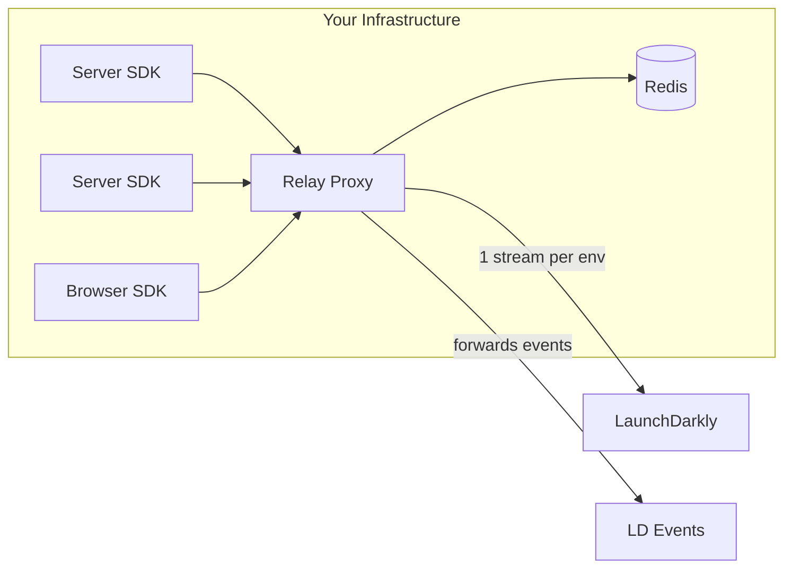
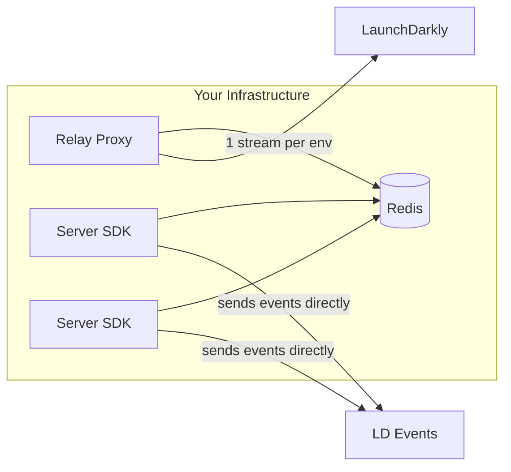
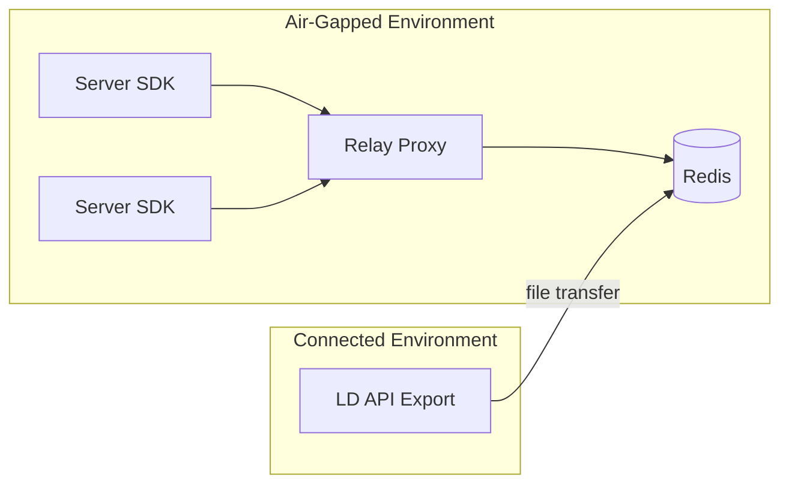

# AI-First Approach: ChatGPT for Relay

**Version:** 2.1
**Author:** Arif Shaikh
**Date:** April 2026

---

## The Problem with v1 Design

The v1 design is form-first with AI bolted on as a sidebar chat (Module 6). This creates two separate experiences: a rigid questionnaire and a disconnected chatbot. Neither feels like what a senior SA would actually do in a client meeting.

A real SA conversation goes like this:
- "Tell me about your setup." (open-ended)
- Client describes their environment naturally
- SA asks follow-ups based on what they hear
- SA draws on a whiteboard while explaining
- SA adapts depth based on the client's technical level
- Client asks questions mid-flow, SA answers inline
- At the end: "Here's what I'd recommend and why"
- Hands over a document

The app should work the same way.

---

## The Vision: Two Modes, One Brain

### Mode 1: Learn (the Relay Proxy Academy)

For SEs and clients who want to understand before they decide.

**What it looks like:**
- Interactive visual explainers with flow diagrams
- "How does proxy mode work?" renders an animated flow diagram
- "What's the difference between proxy and daemon?" shows a side-by-side comparison
- "What happens when LaunchDarkly goes down?" walks through the failure cascade visually
- Each concept has a 30-second visual explanation, not walls of text
- Clients can go as deep as they want. Click "tell me more" to expand.

**Key visual content:**
1. **Mode flow diagrams** - How data flows in proxy mode vs daemon mode vs offline mode
2. **Failure scenario walkthroughs** - What happens when LD is down, when Relay is down, when Redis is down
3. **Connection model** - How server-side vs client-side SDKs connect differently
4. **Caching layers** - Visual of in-memory cache, persistent store, streaming connection
5. **Decision tree** - Interactive "do I need a Relay Proxy?" flowchart the user can click through
6. **Service connection patterns** - How SCs are counted in different architectural patterns (containers, forking, Lambda)
7. **Anti-patterns** - Common mistakes: multiple SDK instances per host, Relay-for-redundancy-only, unscalable persistent store

### Mode 2: Advise (the AI Advisor)

For clients who want a recommendation and artifacts.

**What it looks like:**
- Chat interface as the primary UI (not a sidebar)
- AI conducts the discovery conversation naturally
- Asks smart follow-up questions based on context
- Shows visual artifacts inline as the conversation progresses
- Generates final deliverables at the end

**Conversation flow example:**

```
AI:  "What does your infrastructure look like? Are you running
     on-prem, in the cloud, or a mix?"

User: "We're on AWS, mostly EKS. About 150 microservices. We have
      some on-prem environments too for certain clients."

AI:  "Hybrid setup with EKS and on-prem. That's a common pattern.
     A few things I want to understand:

     1. Can your on-prem environments reach the internet, or are
        any of them air-gapped?
     2. Do you have browser-facing apps that use feature flags,
        or is it all server-side?
     3. Do you already run Redis in your EKS clusters?"

     [Shows a quick diagram of what it's hearing so far]

User: "The on-prem ones go through a firewall proxy. No air-gapped.
      We have a React frontend and some mobile apps. Redis is
      already in EKS, shared with session caching."

AI:  "Got it. Here's where I'm landing:

     [Renders architecture diagram inline]

     You'll want the Relay Proxy in proxy mode because of the
     browser apps. Your on-prem environments need it for the
     firewall routing. And I'd recommend a separate Redis instance
     for Relay since your existing one is shared with sessions
     and likely uses LRU eviction.

     Want me to dig into sizing, or do you have questions about
     the mode recommendation first?"

User: "What's the difference between proxy and daemon mode? Why not
      daemon for us?"

AI:  [Renders side-by-side flow diagram: proxy vs daemon]

     "Proxy mode keeps Relay in the middle. Your SDKs stream
     from Relay, and Relay streams from LaunchDarkly. Your
     React app and mobile SDKs need this because they can't
     read from a database directly.

     Daemon mode skips the middleman. SDKs read flag data
     straight from Redis. It's great for large server-side
     fleets, but it doesn't work for browser or mobile apps.

     Since you have React and mobile, proxy mode is the only
     option that covers everything."
```

---

## Architecture: How It Works

```
+-----------------------------------------------------------------+
|                     Frontend (Next.js)                           |
|                                                                 |
|  +----------------+  +----------------+  +-------------------+  |
|  |  Chat UI       |  |  Learn Mode    |  |  Artifact Panel   |  |
|  |  (primary)     |  |  (visual       |  |  (diagrams,       |  |
|  |                |  |   explainers)  |  |   configs, PDF)   |  |
|  +-------+--------+  +-------+--------+  +---------+---------+  |
|          |                    |                      |           |
|          +--------------------+----------------------+           |
|                               |                                 |
|                    +----------+----------+                      |
|                    |  Diagram Renderer   |                      |
|                    |  (Mermaid.js)       |                      |
|                    +---------------------+                      |
+---------------------------------+-------------------------------+
                                  | API calls
                                  v
+-----------------------------------------------------------------+
|                   Backend (Python / FastAPI)                      |
|                                                                 |
|  +----------------+  +----------------+  +-------------------+  |
|  |  AI Engine     |  |  Rule Engine   |  |  Artifact Gen     |  |
|  |  (Claude API   |  |  (decisions,   |  |  (PDF, configs,   |  |
|  |   + tools)     |  |   sizing)      |  |   diagrams)       |  |
|  +----------------+  +----------------+  +-------------------+  |
|                                                                 |
|  +----------------+  +----------------+                         |
|  |  Grounding     |  |  Profile       |                         |
|  |  Tools         |  |  Builder       |                         |
|  |  (verified     |  |  (from chat)   |                         |
|  |   facts)       |  |                |                         |
|  +----------------+  +----------------+                         |
|                                                                 |
|  +----------------------------------------------------------+  |
|  |  Structured Knowledge Files (JSON)                        |  |
|  |  config-defaults, sizing-numbers, mode-behaviors,         |  |
|  |  failure-scenarios, sc-formulas, anti-patterns, etc.      |  |
|  +----------------------------------------------------------+  |
+-----------------------------------------------------------------+
```

### Key Design Decisions

**1. Chat is the primary interface, not a sidebar.**
The AI conversation IS the discovery process. No forms. The AI extracts structured data (ClientProfile) from natural conversation using tool calls.

**2. Diagrams render inline in the conversation.**
When the AI explains proxy mode, a Mermaid flow diagram appears in the chat. When it recommends an architecture, the diagram renders right there. Not in a separate panel.

**3. Artifacts accumulate in a side panel.**
As the conversation progresses, artifacts build up in a collapsible panel:
- Architecture diagram (updates as the AI learns more)
- Sizing table
- Config file
- Network requirements
- Monitoring playbook
At any point, the client can click "Download Report" to get everything as a PDF.

**4. Learn mode is visual-first, not text-first.**
Every concept has a diagram. Modes, failure scenarios, caching layers, connection models. The AI refers to these visuals in conversation. "Look at the proxy mode diagram above. See how the SDK connects to Relay instead of directly to LD?"

**5. The rule engine stays deterministic.**
The AI orchestrates the conversation, but the actual recommendations come from the same deterministic rules engine. The AI's job is to gather inputs, explain outputs, and answer questions. It doesn't make up recommendations.

**6. Tool-grounded, not RAG.**
No vector store. No embeddings. No retrieval. Instead, Claude calls deterministic tools that return pre-verified facts from structured JSON files. Every answer has a source citation. See "Grounding Architecture" section below.

---

## Grounding Architecture: Tools, Not RAG

### Why Not RAG

RAG solves "I have too much knowledge to fit in context." We don't have that problem. Our knowledge base is ~100 pages of bounded, specific Relay Proxy content. RAG adds complexity (embeddings, vector store, chunking, retrieval tuning) and its own hallucination risks (bad retrieval = bad context = confident wrong answers).

### How Tool-Grounding Works

Claude NEVER states Relay Proxy facts from its own training data. Instead, it calls grounding tools that return pre-verified facts from structured JSON files. Each fact includes its source citation.

```
User: "What's the default cache TTL?"

Claude's process:
  1. Recognizes this is a technical fact
  2. Calls: get_config_defaults(setting="cache_ttl")
  3. Tool returns: {
       "setting": "CACHE_TTL",
       "default": "30s",
       "recommended": "-1 (infinite)",
       "description": "How long Relay trusts in-memory cache before
                       checking persistent store",
       "source": "ld-relay config/config.go:147",
       "official": true
     }
  4. Claude answers using ONLY what the tool returned
  5. Includes the source citation in the response
```

### Grounding Tools

```python
# 1. Configuration facts
get_config_defaults(setting: str) -> ConfigFact
  # Returns verified default values, descriptions, recommendations
  # Source: ld-relay config/config.go + Field Guide pp.101-105

# 2. Sizing guidance
get_sizing_guidance(resource: str) -> SizingFact
  # Returns official numbers with source refs
  # Source: LD docs + Field Guide pp.89-97

# 3. Mode behavior
get_mode_behavior(mode: str) -> ModeFact
  # Returns exact behavior of proxy/daemon/offline
  # Source: Field Guide pp.84-88

# 4. Mode comparison
get_mode_comparison(mode_a: str, mode_b: str) -> ComparisonFact
  # Returns side-by-side differences
  # Source: Field Guide pp.84-88

# 5. Failure scenarios
get_failure_behavior(scenario: str) -> FailureFact
  # Returns what happens when X goes down
  # Source: Field Guide pp.38-45, 106-110

# 6. Network requirements
get_network_requirements(mode: str) -> NetworkFact
  # Returns endpoints, ports, protocols
  # Source: Field Guide pp.24-27

# 7. Reverse proxy checklist
get_reverse_proxy_checklist(proxy_type: str) -> ChecklistFact
  # Returns SSE configuration checklist
  # Source: Field Guide pp.143-144

# 8. Monitoring thresholds
get_monitoring_thresholds() -> MonitoringFact
  # Returns alerting playbook with severity and actions
  # Source: Field Guide pp.111-118

# 9. Cache behavior
get_cache_behavior(ttl_setting: str) -> CacheFact
  # Returns exact caching behavior for given TTL
  # Source: Field Guide pp.119-126

# 10. Service connection formulas
get_sc_formula(pattern: str) -> SCFact
  # Returns SC calculation for architecture pattern
  # Source: ServiceConnection deck slides 19-44

# 11. Anti-pattern check
get_anti_pattern(pattern: str) -> AntiPatternFact
  # Returns warning with explanation
  # Source: Field Guide pp.82-83, SC deck slides 22, 46-51

# 12. Deployment guidance
get_deployment_guidance(platform: str) -> DeploymentFact
  # Returns platform-specific deployment instructions
  # Source: Field Guide pp.98-110

# 13. AutoConfig examples
get_autoconfig_examples(scope: str) -> AutoConfigFact
  # Returns JSON policy examples
  # Source: Field Guide pp.145-148

# --- Action tools (not lookup) ---

# 14. Profile management
update_client_profile(fields: dict) -> ClientProfile
  # Updates the client's profile from conversation context

# 15. Decision engine
run_decision_engine(profile: ClientProfile) -> Recommendation
  # Runs deterministic rules, returns recommendation with reasons

# 16. Sizing calculator
run_sizing_calculator(profile: ClientProfile) -> SizingResult
  # Calculates instance counts, memory, CPU, etc.

# 17. Diagram generation
generate_diagram(type: str, context: dict) -> MermaidCode
  # Generates Mermaid diagram code for rendering

# 18. Config generation
generate_config(recommendation: Recommendation) -> TOMLConfig
  # Generates sample Relay Proxy config file

# 19. Report generation
generate_report(artifacts: AllArtifacts) -> PDFBytes
  # Generates full PDF report via Typst
```

### Structured Knowledge Files

Pre-verified JSON files that grounding tools read from. Every fact has a source citation. Updated manually when the ld-relay codebase or LD docs change.

```
backend/
  knowledge/
    config-defaults.json          # Every config option: default, recommended, description, source
    sizing-numbers.json           # Official + estimate numbers, labeled
    mode-behaviors.json           # Exact behavior of proxy/daemon/offline modes
    failure-scenarios.json        # What happens when LD/Relay/Redis/everything goes down
    network-requirements.json     # Endpoints, ports, protocols by mode
    cache-behavior.json           # TTL settings and their effects
    reverse-proxy-settings.json   # SSE checklist by proxy type (nginx, HAProxy, ALB)
    monitoring-thresholds.json    # Alerting playbook: metric, threshold, severity, action
    sc-formulas.json              # Service connection formulas by architecture pattern
    anti-patterns.json            # Common mistakes with explanations and correct approach
    deployment-guidance.json      # Platform-specific: K8s, ECS, Docker, VM
    autoconfig-examples.json      # AutoConfig policy JSON examples
    faq.json                      # Common questions with verified answers + source
```

### Example: sc-formulas.json

```json
{
  "patterns": [
    {
      "name": "typical_server_side",
      "label": "Typical server-side (one SDK per host)",
      "formula": "SC = number_of_hosts",
      "predictable": true,
      "notes": "Each host runs one application with one SDK instance. One streaming connection per host.",
      "source": "ServiceConnection-RelayProxy deck, slides 19-24"
    },
    {
      "name": "forking",
      "label": "Forking pattern (Ruby, Python with Gunicorn/Unicorn)",
      "formula": "SC = number_of_hosts * number_of_forks",
      "predictable": "moderate",
      "notes": "Each forked process creates its own SDK instance and streaming connection. Common with Ruby (Puma workers) and Python (Gunicorn workers).",
      "source": "ServiceConnection-RelayProxy deck, slides 28-30"
    },
    {
      "name": "containerized",
      "label": "Containerized (Docker/K8s pods)",
      "formula": "SC = number_of_containers",
      "predictable": false,
      "notes": "Each container runs one SDK instance. Hard to predict if containers auto-scale.",
      "source": "ServiceConnection-RelayProxy deck, slides 36-37"
    },
    {
      "name": "containerized_horizontal",
      "label": "Containerized + horizontally scaled",
      "formula": "SC = number_of_containers * number_of_hosts",
      "predictable": false,
      "notes": "Containers spread across multiple hosts. Very hard to predict with dynamic scaling.",
      "source": "ServiceConnection-RelayProxy deck, slides 39-40"
    },
    {
      "name": "containerized_forking",
      "label": "Containerized + horizontally scaled + forking",
      "formula": "SC = number_of_containers * number_of_hosts * number_of_forks",
      "predictable": false,
      "notes": "Worst case for SC count. Each dimension multiplies. Common in Ruby/Python on K8s.",
      "source": "ServiceConnection-RelayProxy deck, slides 40"
    },
    {
      "name": "lambda_serverless",
      "label": "Lambda / serverless",
      "formula": "SC = number_of_concurrent_lambda_instances",
      "predictable": false,
      "notes": "Each Lambda invocation with a cold start creates a new SDK instance. Hard to predict due to Lambda scaling. Consider Relay on EC2 to reduce connections.",
      "source": "ServiceConnection-RelayProxy deck, slides 42-44"
    },
    {
      "name": "relay_sidecar",
      "label": "Containers with Relay as sidecar",
      "formula": "SC = number_of_containers (but only 1 upstream connection per Relay)",
      "predictable": "moderate",
      "notes": "Each container still counts as 1 SC, but outbound connections to LD drop to 1 per Relay sidecar. Reduces network load, not SC count.",
      "source": "ServiceConnection-RelayProxy deck, slide 38"
    }
  ]
}
```

### Example: anti-patterns.json

```json
{
  "anti_patterns": [
    {
      "name": "multiple_sdk_instances_per_host",
      "label": "Multiple SDK instances in one application",
      "description": "Initializing the SDK more than once per application process. A code-level implementation bug.",
      "symptoms": ["High memory usage", "High CPU usage", "High network usage", "Slower initialization", "Stale targeting rules", "EOF errors", "Timeouts", "Requires scaling earlier"],
      "correct_approach": "Initialize the SDK once and share the client instance across your application.",
      "source": "ServiceConnection-RelayProxy deck, slide 22"
    },
    {
      "name": "relay_for_redundancy_only",
      "label": "Using Relay Proxy only as a redundancy layer",
      "description": "Deploying Relay Proxy solely to protect against LaunchDarkly downtime, without other use cases.",
      "why_its_bad": [
        "Relay requires uptime equal to or better than LaunchDarkly itself",
        "Relay array must be warmed up before LD goes down (basically always on)",
        "Requires periodic reassessment to scale Relay independently",
        "Adds infrastructure complexity for a scenario that rarely occurs"
      ],
      "correct_approach": "Keep SDKs connected directly to LaunchDarkly. Use dynamic scaling. Have a switchover plan. Periodically test the plan. SDKs already cache flag data in memory.",
      "source": "ServiceConnection-RelayProxy deck, slides 46-47; Field Guide pp.82-83"
    },
    {
      "name": "client_side_streaming_at_scale",
      "label": "Client-side SDK streaming through Relay at scale",
      "description": "Routing large volumes of client-side (browser/mobile) SDK traffic through Relay Proxy streaming endpoints.",
      "why_its_bad": [
        "Each unique user context creates a separate streaming connection",
        "Connection count scales with users, not with services",
        "LaunchDarkly's CDN-backed endpoints are designed for this scale",
        "Relay becomes a bottleneck for traffic it doesn't need to handle"
      ],
      "correct_approach": "Connect client-side SDKs directly to LaunchDarkly. Only use Relay proxy mode for client-side when you specifically need it (ad-blockers, hiding LD endpoints).",
      "source": "Field Guide pp.82-83, 92-94"
    },
    {
      "name": "daemon_mode_without_understanding_sc",
      "label": "Using Daemon mode without understanding service connection billing",
      "description": "Deploying Daemon mode without realizing that LaunchDarkly currently cannot count service connections from SDKs using Daemon mode.",
      "why_its_bad": [
        "Requires custom billing arrangement",
        "Introduces a critical persistent store dependency",
        "Scaling the persistent store is harder than scaling Relay",
        "SDKs could already cold-start by connecting to a Relay array"
      ],
      "correct_approach": "Understand the SC billing implications before choosing Daemon mode. Only use it when the connection reduction benefit clearly outweighs the added store complexity.",
      "source": "ServiceConnection-RelayProxy deck, slide 51"
    },
    {
      "name": "persistent_store_as_redundancy",
      "label": "Adding persistent store purely for redundancy",
      "description": "Connecting both Relay and SDKs to a persistent store for maximum redundancy without a clear need.",
      "why_its_bad": [
        "Introduces a new point of failure",
        "Requires scaling the persistent store, which is harder and less supported than scaling Relay",
        "SDKs could already cold-start by connecting to their Relay array",
        "More components = more things that can break"
      ],
      "correct_approach": "Use persistent store when you have a clear need: daemon mode (required), Big Segments (required), zero-downtime cold starts. Don't add it 'just in case.'",
      "source": "ServiceConnection-RelayProxy deck, slides 48-50"
    },
    {
      "name": "fewer_than_10_services",
      "label": "Using Relay when you have fewer than 10 server-side services",
      "description": "Deploying Relay Proxy when you have a small number of server-side SDK instances with no network restrictions.",
      "why_its_bad": [
        "Connection savings are minimal (each SDK is just 1 streaming connection)",
        "Relay adds infrastructure to manage, monitor, and scale",
        "Direct connection is simpler and has fewer failure modes"
      ],
      "correct_approach": "Connect SDKs directly to LaunchDarkly unless you have network restrictions, compliance needs, or other specific reasons.",
      "source": "Field Guide pp.82-83"
    }
  ]
}
```

### Hallucination Prevention: Three Layers

**Layer 1: System prompt constraint**
```
CRITICAL RULE: Never state Relay Proxy technical facts from your
own training data. ALWAYS call a grounding tool first.

If the user asks a technical question:
1. Identify which grounding tool covers it
2. Call the tool
3. Answer using ONLY the tool's response
4. Include the source citation

If NO tool covers the question, say:
"I don't have verified information on that specific topic.
Here's where you can check: [relevant official docs URL]"
```

**Layer 2: Tools return facts with citations**
Every tool response includes `source` field. Claude must include it.

**Layer 3: Structured files are auditable**
Every fact in the JSON files can be traced to a specific page in the Field Guide, a slide in the SC deck, a line in the ld-relay codebase, or an official LD docs page. When facts change, update the JSON file and the source reference. No retraining. No re-indexing. Just edit a file.

### When Would We Add RAG?

Only if the domain expands beyond Relay Proxy to cover all of LaunchDarkly (SDKs, Experimentation, Contexts, etc.). At that point the knowledge base outgrows structured files. For "ChatGPT for Relay" specifically, tool-grounding is more reliable and simpler.

---

## Service Connection Patterns (New)

From the internal ServiceConnection-RelayProxy enablement deck (71 slides). This content is critical for sizing and was missing from our v1 design.

### What is a Service Connection?

One SC = one month's worth of streaming connections from a single SDK instance.
- 1 concurrent streaming connection = 1 minute's worth of SCs
- 1 polling request = 1 hour's worth of SCs
- SDKs behind Relay Proxy still count as SCs
- SDKs in Daemon mode: LD currently can't count SCs (custom billing)

### Architecture Pattern Diagrams

These patterns drive both the service connection estimate and the Relay architecture recommendation.

**Pattern 1: Typical server-side**
```
Host -> [App + SDK] -> LaunchDarkly
SC = 1 per host
```

**Pattern 2: Forking (Ruby/Python)**
```
Host -> [Main App + SDK]
         |- Fork 1 + SDK
         |- Fork 2 + SDK
         |- Fork 3 + SDK
SC = hosts * forks
```

**Pattern 3: Containerized**
```
Host -> [Container: App+SDK]
     -> [Container: App+SDK]
     -> [Container: App+SDK]
SC = containers (hard to predict with auto-scaling)
```

**Pattern 4: Containerized with Relay sidecar**
```
Host -> [Container: App+SDK] -+-> [Relay sidecar] -> LaunchDarkly
     -> [Container: App+SDK] -+    (1 upstream connection)
     -> [Container: App+SDK] -+
SC = containers (but only 1 outbound connection per Relay)
```

**Pattern 5: Horizontally scaled containers**
```
LB -> Host 1 -> [containers] -> Relay -> LaunchDarkly
   -> Host 2 -> [containers] -> Relay
   -> Host N -> [containers] -> Relay
SC = containers * hosts
```

**Pattern 6: Lambda / serverless**
```
Lambda instance 1 -> [App+SDK] -+
Lambda instance 2 -> [App+SDK] -+-> Relay on EC2 -> LaunchDarkly
Lambda instance N -> [App+SDK] -+
SC = concurrent Lambda instances (very hard to predict)
```

### Impact on Discovery Questions

New questions needed:
- "Do any of your applications use a forking model?" (Ruby with Puma, Python with Gunicorn)
- "How many worker processes per host?" (forks multiplier)
- "Do you use serverless/Lambda for any LD-enabled services?"
- "Do your containers auto-scale? What's the range?" (min-max for SC estimate)

### Impact on Sizing Calculator

The sizing calculator should now estimate service connections:
```python
def estimate_service_connections(profile):
    base = profile.service_count_numeric
    multiplier = 1

    if profile.uses_forking:
        multiplier *= profile.forks_per_host

    if profile.deployment_platform == "kubernetes":
        multiplier *= profile.replicas_per_service  # pods

    if profile.uses_lambda:
        # Lambda is unpredictable, use peak concurrent estimate
        base += profile.lambda_peak_concurrent

    estimated_sc = base * multiplier
    provisioned_connections = estimated_sc * 2  # 2x buffer per LD guidance

    return {
        "estimated_sc": estimated_sc,
        "formula": f"{base} services * {multiplier} multiplier",
        "provisioned_connections": provisioned_connections,
        "note": "Service connections are hard to predict with auto-scaling. Monitor actual usage.",
        "source": "ServiceConnection-RelayProxy deck + LD sizing guidance"
    }
```

---

## UI/UX Design

### Layout

```
+--------------------------------------------------------------------+
|  LD Relay Advisor                              [Learn] [Advise]     |
+--------------------------------------+-----------------------------+
|                                      |                             |
|  CONVERSATION PANEL                  |  ARTIFACTS PANEL            |
|  (2/3 width)                         |  (1/3 width, collapsible)   |
|                                      |                             |
|  +--------------------------------+  |  +-----------------------+  |
|  | AI: Tell me about your         |  |  | Architecture          |  |
|  | infrastructure...              |  |  | [diagram updates      |  |
|  |                                |  |  |  as conversation      |  |
|  | User: We run on AWS EKS...     |  |  |  progresses]          |  |
|  |                                |  |  +-----------------------+  |
|  | AI: Got it. Based on that:     |  |  | Sizing                |  |
|  | [inline diagram]               |  |  | [table appears when   |  |
|  |                                |  |  |  sizing is discussed] |  |
|  | You'll want proxy mode...      |  |  +-----------------------+  |
|  |                                |  |  | Config                |  |
|  | +----------------------------+ |  |  | [TOML generated]      |  |
|  | | [Mermaid diagram:          | |  |  +-----------------------+  |
|  | |  proxy mode flow]          | |  |  | SC Estimate           |  |
|  | |                            | |  |  | [service connection   |  |
|  | +----------------------------+ |  |  |  calculation]         |  |
|  |                                |  |  +-----------------------+  |
|  | User: What about sizing?       |  |  | Monitoring            |  |
|  |                                |  |  | [alerting playbook]   |  |
|  | AI: For 150 services on        |  |  +-----------------------+  |
|  | EKS, here's what I'd           |  |                             |
|  | recommend...                   |  |  +-----------------------+  |
|  +--------------------------------+  |  | [Download Report]     |  |
|                                      |  |      (PDF)            |  |
|  +--------------------------------+  |  +-----------------------+  |
|  | Type your message...      [->] |  |                             |
|  +--------------------------------+  |                             |
+--------------------------------------+-----------------------------+
| Quick actions: [Explain proxy mode] [Compare modes] [Size my       |
| setup] [Estimate SCs] [Generate config] [Download report]          |
+--------------------------------------------------------------------+
```

### Learn Mode Views

**1. Mode Explorer**
Interactive flow diagrams for each mode. Click on components to learn more.

```
+-----------------------------------------------------+
|  Proxy Mode                                          |
|                                                      |
|  +-------+     +-----------+     +---------------+   |
|  |  SDK  |---->|   Relay   |---->| LaunchDarkly  |   |
|  |       |<----|   Proxy   |<----|               |   |
|  +-------+     +-----+-----+    +---------------+   |
|                       |                              |
|                 +-----+-----+                        |
|                 |   Redis   |                        |
|                 |  (cache)  |                        |
|                 +-----------+                        |
|                                                      |
|  [Click any component for details]                   |
|                                                      |
|  "SDKs connect to Relay instead of directly to       |
|   LaunchDarkly. Relay maintains a single upstream     |
|   connection and fans out to all connected SDKs."    |
+------------------------------------------------------+
```

**2. Failure Scenario Walkthroughs**
Step-by-step visual: "What happens when X goes down?"

```
Scenario: LaunchDarkly becomes unreachable

Step 1: [diagram] Connection drops between Relay and LD
Step 2: [diagram] Relay continues serving cached flag data
Step 3: [diagram] If Redis configured, new Relay instances
        can still start with data from Redis
Step 4: [diagram] SDKs never notice. They keep getting flags
        from Relay's cache.
Step 5: [diagram] When LD comes back, Relay reconnects and
        receives any flag changes.
```

**3. Service Connection Calculator (Interactive)**
User selects their architecture pattern and inputs numbers. Gets an SC estimate instantly.

```
+------------------------------------------------------+
|  Service Connection Estimator                         |
|                                                      |
|  Architecture pattern: [Containerized + forking]     |
|                                                      |
|  Hosts:        [  4  ]                               |
|  Containers:   [ 12  ] per host                      |
|  Forks:        [  3  ] per container                 |
|                                                      |
|  Estimated SCs:  144                                 |
|  Formula: 4 hosts * 12 containers * 3 forks          |
|  Provisioned connections: 288 (2x buffer)            |
|                                                      |
|  [Warning: With auto-scaling, actual SC count may    |
|   vary. Monitor actual usage in LaunchDarkly.]       |
+------------------------------------------------------+
```

**4. Decision Flowchart (Interactive)**
Clickable decision tree. User answers questions by clicking nodes. Ends at a recommendation.

```
[Do your SDKs have direct internet access?]
    |                    |
   YES                  NO
    |                    |
[< 10 services?]    [Air-gapped?]
    |        |          |       |
   YES      NO        YES     NO
    |        |          |       |
[Skip    [Relay      [Offline [Proxy
 Relay]   Proxy]      Mode]   Mode]
```

**5. Anti-Pattern Gallery**
Visual cards showing common mistakes. Each one shows the wrong way, explains why, and shows the right way.

---

## Flow Diagrams to Build

These are the core visual assets. Each one is a Mermaid diagram rendered in the UI.

### 1. Proxy Mode Data Flow


### 2. Daemon Mode Data Flow


### 3. Offline Mode Data Flow


### 4. Failure Scenarios
- LaunchDarkly down (Relay serves cache)
- Relay down (SDKs use in-memory cache)
- Redis down (Relay uses in-memory, new instances cold-start)
- Everything down (SDK fallback values)

### 5. Connection Model Comparison
- Server-side: 1 connection per SDK instance
- Client-side: 1 connection per user context
- With Relay: N SDKs to 1 Relay to 1 LD connection per env

### 6. Caching Layer Visualization
- Layer 1: SDK in-memory cache
- Layer 2: Relay in-memory cache
- Layer 3: Persistent store (Redis/DynamoDB/Consul)
- Layer 4: LaunchDarkly streaming (source of truth)

### 7. Architecture Topology Templates
- Small: 3 Relay instances + 1 Redis primary/replica behind ALB
- Medium: 3-5 Relay instances + Redis cluster, partitioned by env tier
- Large: Multiple Relay clusters, per-region, with DaemonSet or sidecar
- Air-gapped: Offline Relay + file-based data source + manual sync

### 8. Service Connection Patterns (NEW)
- Typical server-side (1 SDK per host)
- Forking pattern (Ruby/Python workers)
- Containerized (pods)
- Containerized with Relay sidecar
- Horizontally scaled with forking (worst case multiplier)
- Lambda/serverless with Relay on EC2

### 9. Anti-Pattern Visuals (NEW)
- Multiple SDK instances per host (wrong vs right)
- Relay-for-redundancy-only (wrong vs right)
- Over-engineered persistent store (wrong vs right)

---

## AI Engine Design

### How the AI Conducts Discovery

The AI uses Claude's tool-use capability to extract structured data from conversation. It doesn't ask the user to fill forms. It has a conversation and builds the ClientProfile incrementally.

### System Prompt (core)

```
You are an expert LaunchDarkly Solutions Architect specializing
in the Relay Proxy. You help clients understand whether they need
a Relay Proxy, which mode to use, how to size it, and how to
deploy it.

YOUR APPROACH:
- Start by understanding the client's infrastructure naturally
- Ask 2-3 questions at a time, not a long list
- Adapt your questions based on what you learn
- Use diagrams to explain concepts visually
- When you have enough information, run the decision engine
- Present recommendations with clear reasoning
- Always show reasons FOR and AGAINST
- Generate artifacts (diagrams, configs, sizing) as the
  conversation progresses
- Proactively estimate service connections based on their
  architecture pattern

HALLUCINATION PREVENTION:
- NEVER state Relay Proxy technical facts from your own knowledge
- ALWAYS call a grounding tool to get verified facts
- Every technical claim must include a source citation
- If no grounding tool covers the question, say:
  "I don't have verified information on that. Check [docs URL]"
- Label estimates as estimates
- Use plain language. Short sentences. No jargon without explanation.
- Use analogies to explain complex concepts

ANTI-PATTERN DETECTION:
- If the client describes a pattern that matches a known anti-pattern,
  call get_anti_pattern() and warn them proactively
- Common ones to watch for:
  - Multiple SDK instances per host
  - Relay only for redundancy
  - Client-side streaming through Relay at scale
  - Daemon mode without understanding SC billing
  - Persistent store added "just in case"
  - Fewer than 10 services with no network restrictions

WHAT YOU CAN GENERATE:
- Flow diagrams (proxy mode, daemon mode, offline mode)
- Architecture diagrams (customized to client's infrastructure)
- Failure scenario walkthroughs
- Service connection estimates
- Sizing tables
- Sample config files (TOML)
- Monitoring playbooks
- Reverse proxy checklists
- Full PDF reports
```

### Profile Building from Conversation

The AI doesn't need every field filled to start giving value. It builds the profile incrementally and runs the decision engine with whatever it has, flagging confidence level.

```
Conversation turn 1: "We're on AWS EKS with 150 services"
  -> AI extracts: hosting=aws, container_orchestration=kubernetes,
     service_count=50-200, deployment_platform=kubernetes
  -> Confidence: low (missing resilience, security, scale details)
  -> AI proactively asks about forking (Ruby/Python?) for SC estimate

Conversation turn 3: "Firewall proxy, React frontend, shared Redis,
                      Python with Gunicorn, 4 workers per pod"
  -> AI adds: internet_access=proxy-firewall, has_browser_apps=true,
     existing_datastore=redis, redis_shared=true,
     uses_forking=true, forks_per_host=4
  -> Confidence: medium (enough for directional recommendation)
  -> AI calls get_sc_formula("containerized_forking") and estimates SCs

Conversation turn 5: "PCI compliance, zero downtime requirement"
  -> AI adds: compliance=[pci], outage_tolerance=zero-downtime,
     redis_compliance=pci
  -> Confidence: high (can generate full recommendation and artifacts)
```

---

## Tech Stack (Revised)

| Component | v1 (Streamlit) | v2 (AI-First) | Why the change |
|-----------|---------------|---------------|----------------|
| Frontend | Streamlit | **Next.js 15 + Tailwind + shadcn/ui** | Chat UI, inline diagrams, split panels, animations |
| Chat UI | Streamlit chat (sidebar) | **Vercel AI SDK + streaming** | Real-time token streaming, tool-call rendering, inline artifacts |
| Diagrams | Text-based ASCII | **Mermaid.js rendered in React** | Interactive, clickable, animated flow diagrams |
| Backend | Streamlit (monolith) | **FastAPI (Python)** | API-first. Serves AI engine, rule engine, artifact generation |
| AI | Claude API (basic) | **Claude API with tool use** | Tool calls for profile building, grounding, diagram generation |
| Knowledge | ChromaDB + RAG | **Structured JSON files + grounding tools** | Simpler, more reliable, auditable, no embeddings needed |
| PDF | Typst | **Typst** (no change) | Still the best option for programmatic PDF |
| Hosting | Streamlit Cloud | **Vercel (frontend) + Railway/Fly (backend)** | Better performance, custom domain, no Streamlit limitations |

### Why Not Streamlit?

Streamlit is great for quick prototypes but hits walls for this vision:
- No split-panel layouts with collapsible sidebars
- Chat component is basic (no inline rendering of diagrams)
- No real-time streaming of AI responses with tool calls
- Limited animation and interactivity
- Can't render Mermaid diagrams inline in chat
- Mobile experience is poor
- No route-based navigation (Learn mode vs Advise mode)

Next.js + shadcn/ui gives us:
- Beautiful, responsive UI out of the box
- Split panel layouts with drag-to-resize
- Vercel AI SDK for streaming chat with tool-call rendering
- Mermaid.js integration for inline diagrams
- Dark mode, animations, polished components
- Route-based navigation (/learn, /advise)
- Static export option for offline use

---

## Revised Build Phases

### Phase 1: Foundation (1 week)

**Goal:** Chat interface that conducts discovery and produces a recommendation.

Build:
- Next.js app with Tailwind + shadcn/ui
- FastAPI backend with Claude API integration
- AI system prompt with tool-use for profile building
- Grounding tools (config defaults, mode behaviors, sizing numbers)
- Structured knowledge JSON files (initial set)
- Rule engine (port existing Python logic)
- Basic chat UI with streaming responses
- Profile extraction from conversation via tool calls
- Recommendation display (inline in chat)

Skip:
- Diagrams (text descriptions for now)
- PDF generation
- Learn mode
- Artifact panel

Done when:
- User can have a natural conversation about their setup
- AI asks smart follow-up questions
- AI calls grounding tools for all technical facts (never hallucinates)
- AI calls the rule engine and shows a recommendation
- Recommendation includes reasons FOR and AGAINST
- Anti-patterns detected and warned about

### Phase 2: Visual Layer (1 week)

**Goal:** Inline diagrams and the artifact panel.

Build:
- Mermaid.js integration for rendering diagrams in chat
- 9 core diagram templates (proxy, daemon, offline, failure scenarios, connection model, caching layers, architecture topology, SC patterns, anti-patterns)
- AI generates diagrams via tool calls during conversation
- Artifact panel (right side, collapsible) that accumulates outputs
- Architecture diagram that updates as the conversation progresses

Skip:
- PDF generation
- Learn mode
- Sizing calculator

Done when:
- AI explains proxy mode with a rendered flow diagram inline
- AI shows a customized architecture diagram based on client inputs
- Artifacts accumulate in the side panel
- Diagrams are interactive (click to expand)

### Phase 3: Artifacts and Sizing (1 week)

**Goal:** Full artifact generation: sizing, configs, monitoring, report.

Build:
- Sizing calculator with SC estimation (port + extend existing Python logic)
- SC formula tool and interactive SC estimator
- Config generator (TOML templates for all modes + stores)
- Reverse proxy checklist generator
- Monitoring playbook generator
- PDF report generation (Typst, triggered from artifact panel)
- "Download Report" button that bundles everything

Skip:
- Learn mode
- Advanced interactivity

Done when:
- AI generates sizing tables inline with SC estimates
- Sample TOML config appears in artifact panel
- Monitoring playbook generated
- PDF report downloadable with all sections
- All 5 client scenarios produce accurate outputs

### Phase 4: Learn Mode (1 week)

**Goal:** Visual, interactive learning experience for Relay Proxy concepts.

Build:
- /learn route with visual explainer pages
- Interactive decision flowchart (click through to get recommendation)
- Mode explorer (proxy vs daemon vs offline with diagrams)
- Failure scenario walkthroughs (step-by-step visual)
- Service connection calculator (interactive pattern selector)
- Anti-pattern gallery (visual cards showing wrong vs right)
- Caching layer visualization
- Connection model comparison
- Each page links to "Ready to get a recommendation? Switch to Advise mode"

Skip:
- Advanced animations
- Video content

Done when:
- SE can walk a client through "how does proxy mode work?" using Learn mode
- Client can self-serve understand whether they need a Relay Proxy
- Client can estimate their service connections interactively
- Every concept has a diagram, not just text
- Learn mode and Advise mode feel like one product

### Phase 5: Polish and Deploy (1 week)

**Goal:** Production-ready, beautiful, fast.

Build:
- Dark mode / light mode
- Mobile responsive layout
- Loading states and animations
- Error handling (API failures, rate limits)
- Quick action buttons ("Explain proxy mode", "Size my setup", "Compare modes", "Estimate SCs")
- Onboarding flow for first-time users
- "About" page
- Deploy: Vercel (frontend) + Railway (backend)
- Custom domain
- End-to-end testing with all 5 client scenarios

Done when:
- A client can go from "I know nothing about Relay Proxy" to "I have a PDF recommendation" in 30 minutes
- An SE can use it live on a client call
- It looks and feels like a product, not a prototype
- Zero hallucinations in all test scenarios

---

## What Makes This Different

| Aspect | Typical internal tool | This app |
|--------|-----------------------|----------|
| Interface | Forms and tabs | Conversation |
| Diagrams | Static images or none | Interactive, generated live |
| Discovery | 18 rigid questions | Natural conversation, adaptive |
| Recommendations | Binary yes/no | Nuanced with FOR, AGAINST, trade-offs |
| Hallucination | AI guesses or RAG retrieves wrong chunk | Tool-grounded, every fact has a source |
| SC estimation | Manual spreadsheet | Interactive pattern-based calculator |
| Anti-patterns | Not detected | Proactively warned during conversation |
| Learning | Separate docs/wiki | Built-in visual explainers |
| Artifacts | Manual document creation | Generated live, accumulate in panel |
| Experience | "Fill this form" | "Tell me about your setup" |

---

## Quick Action Flows

Pre-built conversation starters for common needs:

| Quick Action | What happens |
|-------------|-------------|
| "Explain proxy mode" | AI renders proxy flow diagram and walks through it |
| "Compare modes" | Side-by-side proxy vs daemon vs offline with diagrams |
| "Do I need a Relay Proxy?" | Interactive decision flowchart |
| "Size my setup" | AI asks about scale, generates sizing table |
| "Estimate my service connections" | AI asks about architecture pattern, calculates SCs |
| "Generate a config" | AI asks about mode/store, generates TOML |
| "What if LD goes down?" | Failure scenario walkthrough with visuals |
| "Show me anti-patterns" | Gallery of common mistakes with correct approaches |
| "Download my report" | Generates PDF from all artifacts collected so far |

---

## File Structure (Revised)

```
ld-relay-advisor/
  frontend/                        # Next.js app
    app/
      layout.tsx                   # Root layout with nav
      page.tsx                     # Landing / mode selector
      advise/
        page.tsx                   # Chat-based advisor
      learn/
        page.tsx                   # Learning hub
        modes/page.tsx             # Mode explorer
        failures/page.tsx          # Failure scenarios
        decision-tree/page.tsx     # Interactive flowchart
        sc-calculator/page.tsx     # Service connection estimator
        anti-patterns/page.tsx     # Anti-pattern gallery
    components/
      chat/
        ChatPanel.tsx              # Main chat interface
        MessageBubble.tsx          # Chat message with inline diagrams
        ArtifactPanel.tsx          # Right-side artifact accumulator
        QuickActions.tsx           # Quick action buttons
      diagrams/
        MermaidRenderer.tsx        # Renders Mermaid diagrams
        ProxyFlowDiagram.tsx       # Proxy mode flow
        DaemonFlowDiagram.tsx      # Daemon mode flow
        OfflineFlowDiagram.tsx     # Offline mode flow
        ArchitectureDiagram.tsx    # Customized architecture
        FailureWalkthrough.tsx     # Step-by-step failure scenario
        DecisionTree.tsx           # Interactive decision flowchart
        CachingLayers.tsx          # Caching visualization
        ConnectionModel.tsx        # Connection comparison
        SCPatterns.tsx             # Service connection patterns
        AntiPatternCards.tsx       # Anti-pattern visuals
      artifacts/
        SizingTable.tsx            # Sizing output
        SCEstimate.tsx             # Service connection estimate
        ConfigViewer.tsx           # TOML config with syntax highlighting
        MonitoringPlaybook.tsx     # Alerting thresholds
        ReverseProxyChecklist.tsx  # SSE configuration checklist
        NetworkRequirements.tsx    # Endpoints and ports table
      learn/
        ModeExplorer.tsx           # Interactive mode comparison
        ConceptCard.tsx            # Visual concept explainer
        SCCalculator.tsx           # Interactive SC estimator
    lib/
      api.ts                       # Backend API client
      types.ts                     # TypeScript types matching Python models

  backend/                         # FastAPI app
    main.py                        # FastAPI entry point
    routers/
      chat.py                      # Chat endpoint (streaming)
      artifacts.py                 # Artifact generation endpoints
      report.py                    # PDF generation endpoint
    engine/
      rules.py                     # Decision rules
      sizing_calculator.py         # Sizing math + SC estimation
      config_generator.py          # TOML config generation
      diagram_generator.py         # Mermaid diagram generation
      profile_builder.py           # Extracts ClientProfile from chat
    ai/
      system_prompt.py             # AI system prompt
      tools.py                     # Grounding tool implementations
      tool_definitions.py          # Tool schemas for Claude API
    knowledge/                     # Structured knowledge files (JSON)
      config-defaults.json
      sizing-numbers.json
      mode-behaviors.json
      failure-scenarios.json
      network-requirements.json
      cache-behavior.json
      reverse-proxy-settings.json
      monitoring-thresholds.json
      sc-formulas.json
      anti-patterns.json
      deployment-guidance.json
      autoconfig-examples.json
      faq.json
    models/
      client_profile.py            # ClientProfile dataclass
      recommendation.py            # ArchitectureRecommendation dataclass
      sizing_result.py             # SizingResult dataclass
    templates/
      report.typ                   # Typst PDF template
      configs/                     # TOML config templates

  docs/                            # Planning docs (existing)
  research/                        # Research (existing)
```

---

## Success Metrics (Revised)

| Metric | Target |
|--------|--------|
| Time to recommendation | < 15 minutes of conversation |
| Time to full report PDF | < 30 minutes |
| SA prep time per client | < 15 minutes (vs 4-8 hours today) |
| Client self-service rate | 70% can get a recommendation without an SA |
| Recommendation accuracy | 90%+ match with experienced SA advice |
| Hallucination rate | 0% on technical facts (every fact tool-grounded) |
| Client shares the PDF | 80% of PDFs get shared with at least one other person |

---

## What We Keep from v1

Everything under the hood stays:
- ClientProfile dataclass (with the new fields we added)
- Decision rules (with anti-patterns)
- Sizing calculator (with scaling signals)
- Config templates (with DynamoDB/Consul/offline options)
- Field Guide patterns research
- Source of truth verification approach
- Privacy by design (no persistent storage)

What changes is how the user interacts with it. Forms become conversation. Text becomes diagrams. Sidebar becomes the primary interface. RAG becomes tool-grounding. And service connection estimation becomes a first-class feature.
