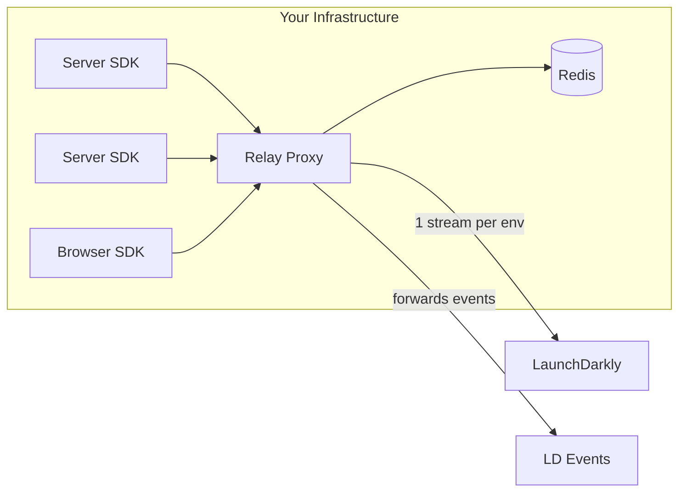
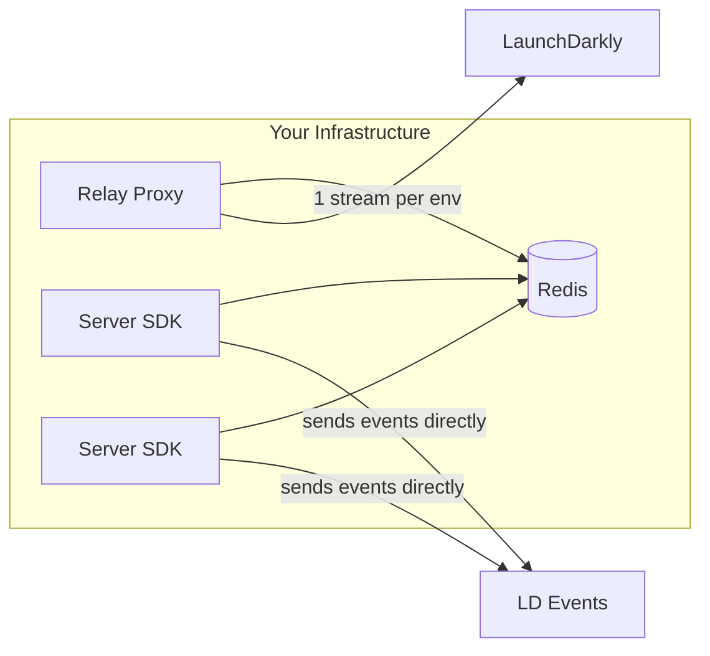
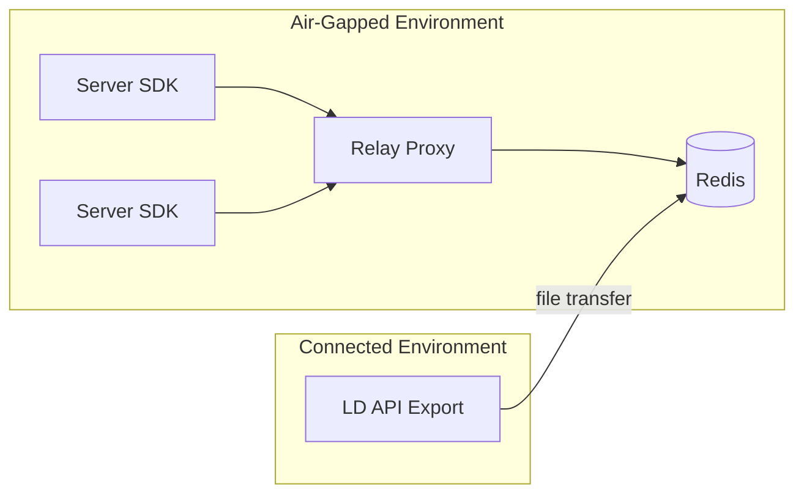

# AI-First Approach: ChatGPT for Relay

**Version:** 2.0
**Author:** Arif Shaikh
**Date:** April 2026

---

## The Problem with v1 Design

The v1 design is form-first with AI bolted on as a sidebar chat (Module 6). This creates two separate experiences: a rigid questionnaire and a disconnected chatbot. Neither feels like what a senior SA would actually do in a client meeting.

A real SA conversation goes like this:
- "Tell me about your setup." (open-ended)
- Client describes their environment naturally
- SA asks follow-ups based on what they hear
- SA draws on a whiteboard while explaining
- SA adapts depth based on the client's technical level
- Client asks questions mid-flow, SA answers inline
- At the end: "Here's what I'd recommend and why"
- Hands over a document

The app should work the same way.

---

## The Vision: Two Modes, One Brain

### Mode 1: Learn (the Relay Proxy Academy)

For SEs and clients who want to understand before they decide.

**What it looks like:**
- Interactive visual explainers with flow diagrams
- "How does proxy mode work?" renders an animated flow diagram
- "What's the difference between proxy and daemon?" shows a side-by-side comparison
- "What happens when LaunchDarkly goes down?" walks through the failure cascade visually
- Each concept has a 30-second visual explanation, not walls of text
- Clients can go as deep as they want. Click "tell me more" to expand.

**Key visual content:**
1. **Mode flow diagrams** - How data flows in proxy mode vs daemon mode vs offline mode
2. **Failure scenario walkthroughs** - What happens when LD is down, when Relay is down, when Redis is down
3. **Connection model** - How server-side vs client-side SDKs connect differently
4. **Caching layers** - Visual of in-memory cache, persistent store, streaming connection
5. **Decision tree** - Interactive "do I need a Relay Proxy?" flowchart the user can click through

### Mode 2: Advise (the AI Advisor)

For clients who want a recommendation and artifacts.

**What it looks like:**
- Chat interface as the primary UI (not a sidebar)
- AI conducts the discovery conversation naturally
- Asks smart follow-up questions based on context
- Shows visual artifacts inline as the conversation progresses
- Generates final deliverables at the end

**Conversation flow example:**

```
AI:  "What does your infrastructure look like? Are you running
     on-prem, in the cloud, or a mix?"

User: "We're on AWS, mostly EKS. About 150 microservices. We have
      some on-prem environments too for certain clients."

AI:  "Hybrid setup with EKS and on-prem. That's a common pattern.
     A few things I want to understand:

     1. Can your on-prem environments reach the internet, or are
        any of them air-gapped?
     2. Do you have browser-facing apps that use feature flags,
        or is it all server-side?
     3. Do you already run Redis in your EKS clusters?"

     [Shows a quick diagram of what it's hearing so far]

User: "The on-prem ones go through a firewall proxy. No air-gapped.
      We have a React frontend and some mobile apps. Redis is
      already in EKS, shared with session caching."

AI:  "Got it. Here's where I'm landing:

     [Renders architecture diagram inline]

     You'll want the Relay Proxy in proxy mode because of the
     browser apps. Your on-prem environments need it for the
     firewall routing. And I'd recommend a separate Redis instance
     for Relay since your existing one is shared with sessions
     and likely uses LRU eviction.

     Want me to dig into sizing, or do you have questions about
     the mode recommendation first?"

User: "What's the difference between proxy and daemon mode? Why not
      daemon for us?"

AI:  [Renders side-by-side flow diagram: proxy vs daemon]

     "Proxy mode keeps Relay in the middle. Your SDKs stream
     from Relay, and Relay streams from LaunchDarkly. Your
     React app and mobile SDKs need this because they can't
     read from a database directly.

     Daemon mode skips the middleman. SDKs read flag data
     straight from Redis. It's great for large server-side
     fleets, but it doesn't work for browser or mobile apps.

     Since you have React and mobile, proxy mode is the only
     option that covers everything."
```

---

## Architecture: How It Works

```
┌─────────────────────────────────────────────────────────────┐
│                     Frontend (Next.js)                       │
│                                                             │
│  ┌──────────────┐  ┌──────────────┐  ┌─────────────────┐  │
│  │  Chat UI      │  │  Learn Mode   │  │  Artifact Panel  │  │
│  │  (primary)    │  │  (visual      │  │  (diagrams,      │  │
│  │              │  │   explainers)  │  │   configs, PDF)  │  │
│  └──────┬───────┘  └──────┬───────┘  └────────┬────────┘  │
│         │                 │                    │            │
│         └─────────────────┼────────────────────┘            │
│                           │                                 │
│                    ┌──────┴───────┐                         │
│                    │  Diagram      │                         │
│                    │  Renderer     │                         │
│                    │  (Mermaid/D2) │                         │
│                    └──────────────┘                         │
└───────────────────────────┬─────────────────────────────────┘
                            │ API calls
                            v
┌─────────────────────────────────────────────────────────────┐
│                   Backend (Python / FastAPI)                  │
│                                                             │
│  ┌──────────────┐  ┌──────────────┐  ┌─────────────────┐  │
│  │  AI Engine    │  │  Rule Engine  │  │  Artifact Gen    │  │
│  │  (Claude API  │  │  (decisions,  │  │  (PDF, configs,  │  │
│  │   + RAG)      │  │   sizing)     │  │   diagrams)      │  │
│  └──────────────┘  └──────────────┘  └─────────────────┘  │
│                                                             │
│  ┌──────────────┐  ┌──────────────┐                        │
│  │  Knowledge    │  │  Profile      │                        │
│  │  Base (RAG)   │  │  Builder      │                        │
│  │  (ChromaDB)   │  │  (from chat)  │                        │
│  └──────────────┘  └──────────────┘                        │
└─────────────────────────────────────────────────────────────┘
```

### Key Design Decisions

**1. Chat is the primary interface, not a sidebar.**
The AI conversation IS the discovery process. No forms. The AI extracts structured data (ClientProfile) from natural conversation using tool calls.

**2. Diagrams render inline in the conversation.**
When the AI explains proxy mode, a Mermaid flow diagram appears in the chat. When it recommends an architecture, the diagram renders right there. Not in a separate panel.

**3. Artifacts accumulate in a side panel.**
As the conversation progresses, artifacts build up in a collapsible panel:
- Architecture diagram (updates as the AI learns more)
- Sizing table
- Config file
- Network requirements
- Monitoring playbook
At any point, the client can click "Download Report" to get everything as a PDF.

**4. Learn mode is visual-first, not text-first.**
Every concept has a diagram. Modes, failure scenarios, caching layers, connection models. The AI refers to these visuals in conversation. "Look at the proxy mode diagram above. See how the SDK connects to Relay instead of directly to LD?"

**5. The rule engine stays deterministic.**
The AI orchestrates the conversation, but the actual recommendations come from the same deterministic rules engine. The AI's job is to gather inputs, explain outputs, and answer questions. It doesn't make up recommendations.

---

## UI/UX Design

### Layout

```
┌──────────────────────────────────────────────────────────────────┐
│  LD Relay Advisor                              [Learn] [Advise]  │
├────────────────────────────────────┬─────────────────────────────┤
│                                    │                             │
│  CONVERSATION PANEL                │  ARTIFACTS PANEL            │
│  (2/3 width)                       │  (1/3 width, collapsible)   │
│                                    │                             │
│  ┌──────────────────────────────┐  │  ┌─────────────────────┐   │
│  │ AI: Tell me about your       │  │  │ Architecture        │   │
│  │ infrastructure...            │  │  │ [diagram updates     │   │
│  │                              │  │  │  as conversation     │   │
│  │ User: We run on AWS EKS...   │  │  │  progresses]         │   │
│  │                              │  │  ├─────────────────────┤   │
│  │ AI: Got it. Based on that:   │  │  │ Sizing              │   │
│  │ [inline diagram]             │  │  │ [table appears when  │   │
│  │                              │  │  │  sizing is discussed]│   │
│  │ You'll want proxy mode...    │  │  ├─────────────────────┤   │
│  │                              │  │  │ Config              │   │
│  │ ┌──────────────────────┐    │  │  │ [TOML generated]     │   │
│  │ │ [Mermaid diagram:    │    │  │  ├─────────────────────┤   │
│  │ │  proxy mode flow]    │    │  │  │ Monitoring           │   │
│  │ │                      │    │  │  │ [alerting playbook]  │   │
│  │ └──────────────────────┘    │  │  └─────────────────────┘   │
│  │                              │  │                             │
│  │ User: What about sizing?     │  │  ┌─────────────────────┐   │
│  │                              │  │  │ [Download Report]    │   │
│  │ AI: For 150 services on      │  │  │      (PDF)          │   │
│  │ EKS, here's what I'd         │  │  └─────────────────────┘   │
│  │ recommend...                 │  │                             │
│  └──────────────────────────────┘  │                             │
│                                    │                             │
│  ┌──────────────────────────────┐  │                             │
│  │ Type your message...    [->] │  │                             │
│  └──────────────────────────────┘  │                             │
├────────────────────────────────────┴─────────────────────────────┤
│  Quick actions: [Explain proxy mode] [Compare modes] [Size my    │
│  setup] [Generate config] [Download report]                      │
└──────────────────────────────────────────────────────────────────┘
```

### Learn Mode Views

**1. Mode Explorer**
Interactive flow diagrams for each mode. Click on components to learn more.

```
┌─────────────────────────────────────────────────────┐
│  Proxy Mode                                          │
│                                                     │
│  ┌─────┐     ┌─────────┐     ┌───────────────┐    │
│  │ SDK │────>│  Relay   │────>│  LaunchDarkly │    │
│  │     │<────│  Proxy   │<────│               │    │
│  └─────┘     └────┬────┘     └───────────────┘    │
│                    │                                │
│               ┌────┴────┐                           │
│               │  Redis   │                           │
│               │ (cache)  │                           │
│               └─────────┘                           │
│                                                     │
│  [Click any component for details]                  │
│                                                     │
│  "SDKs connect to Relay instead of directly to      │
│   LaunchDarkly. Relay maintains a single upstream    │
│   connection and fans out to all connected SDKs."   │
└─────────────────────────────────────────────────────┘
```

**2. Failure Scenario Walkthroughs**
Step-by-step visual: "What happens when X goes down?"

```
Scenario: LaunchDarkly becomes unreachable

Step 1: [diagram] Connection drops between Relay and LD
Step 2: [diagram] Relay continues serving cached flag data
Step 3: [diagram] If Redis configured, new Relay instances
        can still start with data from Redis
Step 4: [diagram] SDKs never notice. They keep getting flags
        from Relay's cache.
Step 5: [diagram] When LD comes back, Relay reconnects and
        receives any flag changes.
```

**3. Decision Flowchart (Interactive)**
Clickable decision tree. User answers questions by clicking nodes. Ends at a recommendation.

```
[Do your SDKs have direct internet access?]
    |                    |
   YES                  NO
    |                    |
[< 10 services?]    [Air-gapped?]
    |        |          |       |
   YES      NO        YES     NO
    |        |          |       |
[Skip    [Relay      [Offline [Proxy
 Relay]   Proxy]      Mode]   Mode]
```

---

## Flow Diagrams to Build

These are the core visual assets. Each one is a Mermaid or D2 diagram rendered in the UI.

### 1. Proxy Mode Data Flow


### 2. Daemon Mode Data Flow


### 3. Offline Mode Data Flow


### 4. Failure Scenarios
- LaunchDarkly down (Relay serves cache)
- Relay down (SDKs use in-memory cache)
- Redis down (Relay uses in-memory, new instances cold-start)
- Everything down (SDK fallback values)

### 5. Connection Model Comparison
- Server-side: 1 connection per SDK instance
- Client-side: 1 connection per user context
- With Relay: N SDKs to 1 Relay to 1 LD connection per env

### 6. Caching Layer Visualization
- Layer 1: SDK in-memory cache
- Layer 2: Relay in-memory cache
- Layer 3: Persistent store (Redis/DynamoDB/Consul)
- Layer 4: LaunchDarkly streaming (source of truth)

### 7. Architecture Topology Templates
- Small: 3 Relay instances + 1 Redis primary/replica behind ALB
- Medium: 3-5 Relay instances + Redis cluster, partitioned by env tier
- Large: Multiple Relay clusters, per-region, with DaemonSet or sidecar
- Air-gapped: Offline Relay + file-based data source + manual sync

---

## AI Engine Design

### How the AI Conducts Discovery

The AI uses Claude's tool-use capability to extract structured data from conversation. It doesn't ask the user to fill forms. It has a conversation and builds the ClientProfile incrementally.

```python
# Tools available to the AI during conversation
tools = [
    {
        "name": "update_client_profile",
        "description": "Update the client's profile based on what they've shared",
        "parameters": {
            "hosting": "on-prem | aws | azure | gcp | hybrid",
            "internet_access": "direct | proxy-firewall | air-gapped",
            # ... all ClientProfile fields
        }
    },
    {
        "name": "run_decision_engine",
        "description": "Run the rule engine to generate a recommendation",
        "parameters": {"profile": "ClientProfile"}
    },
    {
        "name": "generate_diagram",
        "description": "Generate a Mermaid diagram to show inline",
        "parameters": {
            "type": "proxy-flow | daemon-flow | offline-flow | architecture | failure-scenario",
            "context": "specific parameters for the diagram"
        }
    },
    {
        "name": "calculate_sizing",
        "description": "Run the sizing calculator",
        "parameters": {"profile": "ClientProfile"}
    },
    {
        "name": "generate_config",
        "description": "Generate a sample Relay Proxy config file",
        "parameters": {"recommendation": "ArchitectureRecommendation"}
    },
    {
        "name": "generate_report",
        "description": "Generate the full PDF report",
        "parameters": {"all_artifacts": "collected artifacts"}
    },
    {
        "name": "search_knowledge_base",
        "description": "Search the Relay Proxy knowledge base for specific technical details",
        "parameters": {"query": "search query"}
    }
]
```

### System Prompt (core)

```
You are an expert LaunchDarkly Solutions Architect specializing
in the Relay Proxy. You help clients understand whether they need
a Relay Proxy, which mode to use, how to size it, and how to
deploy it.

YOUR APPROACH:
- Start by understanding the client's infrastructure naturally
- Ask 2-3 questions at a time, not a long list
- Adapt your questions based on what you learn
- Use diagrams to explain concepts visually
- When you have enough information, run the decision engine
- Present recommendations with clear reasoning
- Always show reasons FOR and AGAINST
- Generate artifacts (diagrams, configs, sizing) as the
  conversation progresses

YOUR RULES:
- All technical claims must be verified against the knowledge base
- Use the search_knowledge_base tool when you need specific facts
- Label estimates as estimates
- Never make up Relay Proxy behavior
- If you cannot verify something, say so
- Use plain language. Short sentences. No jargon without explanation.
- Use analogies to explain complex concepts

WHAT YOU CAN GENERATE:
- Flow diagrams (proxy mode, daemon mode, offline mode)
- Architecture diagrams (customized to client's infrastructure)
- Failure scenario walkthroughs
- Sizing tables
- Sample config files (TOML)
- Monitoring playbooks
- Reverse proxy checklists
- Full PDF reports
```

### Profile Building from Conversation

The AI doesn't need every field filled to start giving value. It builds the profile incrementally and runs the decision engine with whatever it has, flagging confidence level.

```
Conversation turn 1: "We're on AWS EKS with 150 services"
  -> AI extracts: hosting=aws, container_orchestration=kubernetes,
     service_count=50-200, deployment_platform=kubernetes
  -> Confidence: low (missing resilience, security, scale details)

Conversation turn 3: "Firewall proxy, React frontend, shared Redis"
  -> AI adds: internet_access=proxy-firewall, has_browser_apps=true,
     existing_datastore=redis, redis_shared=true
  -> Confidence: medium (enough for a directional recommendation)

Conversation turn 5: "PCI compliance, zero downtime requirement"
  -> AI adds: compliance=[pci], outage_tolerance=zero-downtime,
     redis_compliance=pci
  -> Confidence: high (can generate full recommendation and artifacts)
```

---

## Tech Stack (Revised)

| Component | v1 (Streamlit) | v2 (AI-First) | Why the change |
|-----------|---------------|---------------|----------------|
| Frontend | Streamlit | **Next.js 15 + Tailwind + shadcn/ui** | Chat UI, inline diagrams, split panels, animations. Streamlit can't do this well. |
| Chat UI | Streamlit chat (sidebar) | **Vercel AI SDK + streaming** | Real-time token streaming, tool-call rendering, inline artifacts |
| Diagrams | Text-based ASCII | **Mermaid.js rendered in React** | Interactive, clickable, animated flow diagrams |
| Backend | Streamlit (monolith) | **FastAPI (Python)** | API-first. Serves the AI engine, rule engine, artifact generation. |
| AI | Claude API (basic) | **Claude API with tool use** | Tool calls for profile building, diagram generation, RAG search |
| RAG | ChromaDB + basic search | **ChromaDB + Voyage embeddings** | Better retrieval for technical content |
| PDF | Typst | **Typst** (no change) | Still the best option for programmatic PDF |
| Hosting | Streamlit Cloud | **Vercel (frontend) + Railway/Fly (backend)** | Better performance, custom domain, no Streamlit limitations |
| Diagrams (advanced) | None | **D2 or Excalidraw** (future) | For editable architecture diagrams |

### Why Not Streamlit?

Streamlit is great for quick prototypes but hits walls for this vision:
- No split-panel layouts with collapsible sidebars
- Chat component is basic (no inline rendering of diagrams)
- No real-time streaming of AI responses with tool calls
- Limited animation and interactivity
- Can't render Mermaid diagrams inline in chat
- Mobile experience is poor
- No route-based navigation (Learn mode vs Advise mode)

Next.js + shadcn/ui gives us:
- Beautiful, responsive UI out of the box
- Split panel layouts with drag-to-resize
- Vercel AI SDK for streaming chat with tool-call rendering
- Mermaid.js integration for inline diagrams
- Dark mode, animations, polished components
- Route-based navigation (/learn, /advise)
- Static export option for offline use

---

## Revised Build Phases

### Phase 1: Foundation (1 week)

**Goal:** Chat interface that can conduct a discovery conversation and produce a recommendation.

Build:
- Next.js app with Tailwind + shadcn/ui
- FastAPI backend with Claude API integration
- AI system prompt with tool-use for profile building
- Rule engine (port existing Python logic)
- Basic chat UI with streaming responses
- Profile extraction from conversation via tool calls
- Recommendation display (inline in chat)

Skip:
- Diagrams (text descriptions for now)
- PDF generation
- Learn mode
- Artifact panel

Done when:
- User can have a natural conversation about their setup
- AI asks smart follow-up questions
- AI calls the rule engine and shows a recommendation
- Recommendation includes reasons FOR and AGAINST

### Phase 2: Visual Layer (1 week)

**Goal:** Inline diagrams and the artifact panel.

Build:
- Mermaid.js integration for rendering diagrams in chat
- 7 core diagram templates (proxy flow, daemon flow, offline flow, failure scenarios, connection model, caching layers, architecture topology)
- AI generates diagrams via tool calls during conversation
- Artifact panel (right side, collapsible) that accumulates outputs
- Architecture diagram that updates as the conversation progresses

Skip:
- PDF generation
- Learn mode
- Sizing calculator

Done when:
- AI explains proxy mode with a rendered flow diagram inline
- AI shows a customized architecture diagram based on client inputs
- Artifacts accumulate in the side panel
- Diagrams are interactive (click to expand)

### Phase 3: Artifacts and Sizing (1 week)

**Goal:** Full artifact generation: sizing, configs, monitoring, report.

Build:
- Sizing calculator (port existing Python logic)
- Config generator (TOML templates, now including DynamoDB/Consul/offline)
- Reverse proxy checklist generator
- Monitoring playbook generator
- PDF report generation (Typst, triggered from artifact panel)
- "Download Report" button that bundles everything

Skip:
- Learn mode
- Advanced interactivity

Done when:
- AI generates sizing tables inline in conversation
- Sample TOML config appears in artifact panel
- Monitoring playbook generated
- PDF report downloadable with all 16 sections
- All 5 client scenarios produce accurate outputs

### Phase 4: Learn Mode (1 week)

**Goal:** Visual, interactive learning experience for Relay Proxy concepts.

Build:
- /learn route with visual explainer pages
- Interactive decision flowchart (click through to get recommendation)
- Mode explorer (proxy vs daemon vs offline with diagrams)
- Failure scenario walkthroughs (step-by-step visual)
- Caching layer visualization
- Connection model comparison
- Each page links to "Ready to get a recommendation? Switch to Advise mode"

Skip:
- Advanced animations
- Video content

Done when:
- SE can walk a client through "how does proxy mode work?" using Learn mode
- Client can self-serve understand whether they need a Relay Proxy
- Every concept has a diagram, not just text
- Learn mode and Advise mode feel like one product

### Phase 5: RAG and Knowledge Base (1 week)

**Goal:** Deep knowledge base for answering technical follow-ups.

Build:
- RAG pipeline (Voyage embeddings + ChromaDB)
- Index: ld-relay codebase, Field Guide, official docs, client patterns
- AI uses search_knowledge_base tool for specific technical questions
- Source citations in every answer
- "I don't know" response when knowledge base doesn't cover it

Skip:
- Fine-tuning
- Conversation memory across sessions

Done when:
- "What does cache TTL -1 actually do?" returns a cited, accurate answer
- "What happens if Redis goes down during an LD outage?" gets a detailed walkthrough
- AI refuses to make up behavior not in the knowledge base

### Phase 6: Polish and Deploy (1 week)

**Goal:** Production-ready, beautiful, fast.

Build:
- Dark mode / light mode
- Mobile responsive layout
- Loading states and animations
- Error handling (API failures, rate limits)
- Quick action buttons ("Explain proxy mode", "Size my setup", "Compare modes")
- Onboarding flow for first-time users
- "About" page
- Deploy: Vercel (frontend) + Railway (backend)
- Custom domain

Done when:
- A client can go from "I know nothing about Relay Proxy" to "I have a PDF recommendation" in 30 minutes
- An SE can use it live on a client call
- It looks and feels like a product, not a prototype

---

## What Makes This Different

| Aspect | Typical internal tool | This app |
|--------|-----------------------|----------|
| Interface | Forms and tabs | Conversation |
| Diagrams | Static images or none | Interactive, generated live |
| Discovery | 18 rigid questions | Natural conversation, adaptive |
| Recommendations | Binary yes/no | Nuanced with FOR, AGAINST, trade-offs |
| Learning | Separate docs/wiki | Built-in visual explainers |
| Artifacts | Manual document creation | Generated live, accumulate in panel |
| Experience | "Fill this form" | "Tell me about your setup" |

---

## Quick Action Flows

Pre-built conversation starters for common needs:

| Quick Action | What happens |
|-------------|-------------|
| "Explain proxy mode" | AI renders proxy flow diagram and walks through it |
| "Compare modes" | Side-by-side proxy vs daemon vs offline with diagrams |
| "Do I need a Relay Proxy?" | Interactive decision flowchart |
| "Size my setup" | AI asks about scale, generates sizing table |
| "Generate a config" | AI asks about mode/store, generates TOML |
| "What if LD goes down?" | Failure scenario walkthrough with visuals |
| "Download my report" | Generates PDF from all artifacts collected so far |

---

## File Structure (Revised)

```
ld-relay-advisor/
  frontend/                        # Next.js app
    app/
      layout.tsx                   # Root layout with nav
      page.tsx                     # Landing / mode selector
      advise/
        page.tsx                   # Chat-based advisor
      learn/
        page.tsx                   # Learning hub
        modes/page.tsx             # Mode explorer
        failures/page.tsx          # Failure scenarios
        decision-tree/page.tsx     # Interactive flowchart
    components/
      chat/
        ChatPanel.tsx              # Main chat interface
        MessageBubble.tsx          # Chat message with inline diagrams
        ArtifactPanel.tsx          # Right-side artifact accumulator
        QuickActions.tsx           # Quick action buttons
      diagrams/
        MermaidRenderer.tsx        # Renders Mermaid diagrams
        ProxyFlowDiagram.tsx       # Proxy mode flow
        DaemonFlowDiagram.tsx      # Daemon mode flow
        OfflineFlowDiagram.tsx     # Offline mode flow
        ArchitectureDiagram.tsx    # Customized architecture
        FailureWalkthrough.tsx     # Step-by-step failure scenario
        DecisionTree.tsx           # Interactive decision flowchart
        CachingLayers.tsx          # Caching visualization
        ConnectionModel.tsx        # Connection comparison
      artifacts/
        SizingTable.tsx            # Sizing output
        ConfigViewer.tsx           # TOML config with syntax highlighting
        MonitoringPlaybook.tsx     # Alerting thresholds
        ReverseProxyChecklist.tsx  # SSE configuration checklist
        NetworkRequirements.tsx    # Endpoints and ports table
      learn/
        ModeExplorer.tsx           # Interactive mode comparison
        ConceptCard.tsx            # Visual concept explainer
    lib/
      api.ts                       # Backend API client
      types.ts                     # TypeScript types matching Python models

  backend/                         # FastAPI app
    main.py                        # FastAPI entry point
    routers/
      chat.py                      # Chat endpoint (streaming)
      artifacts.py                 # Artifact generation endpoints
      report.py                    # PDF generation endpoint
    engine/
      rules.py                     # Decision rules (same as v1)
      sizing_calculator.py         # Sizing math (same as v1)
      config_generator.py          # TOML config generation
      diagram_generator.py         # Mermaid diagram generation
      profile_builder.py           # Extracts ClientProfile from chat
    ai/
      system_prompt.py             # AI system prompt and tool definitions
      tools.py                     # Tool implementations for Claude
      rag.py                       # RAG pipeline
    knowledge/
      indexer.py                   # Build RAG index
      retriever.py                 # Query RAG index
      sources/                     # Knowledge base files
    models/
      client_profile.py            # ClientProfile dataclass
      recommendation.py            # ArchitectureRecommendation dataclass
      sizing_result.py             # SizingResult dataclass
    templates/
      report.typ                   # Typst PDF template
      configs/                     # TOML config templates

  docs/                            # Planning docs (existing)
  research/                        # Research (existing)
```

---

## Success Metrics (Revised)

| Metric | Target |
|--------|--------|
| Time to recommendation | < 15 minutes of conversation |
| Time to full report PDF | < 30 minutes |
| SA prep time per client | < 15 minutes (vs 4-8 hours today) |
| Client self-service rate | 70% can get a recommendation without an SA |
| Recommendation accuracy | 90%+ match with experienced SA advice |
| Client shares the PDF | 80% of PDFs get shared with at least one other person |
| "Wow" reaction | Clients say "this is exactly what I needed" |

---

## What We Keep from v1

Everything under the hood stays:
- ClientProfile dataclass (with the new fields we just added)
- Decision rules (with the new anti-patterns)
- Sizing calculator (with scaling signals)
- Config templates (with new DynamoDB/Consul/offline options)
- Field Guide patterns research
- Source of truth verification approach
- Privacy by design (no persistent storage)

What changes is how the user interacts with it. Forms become conversation. Text becomes diagrams. Sidebar becomes the primary interface.
